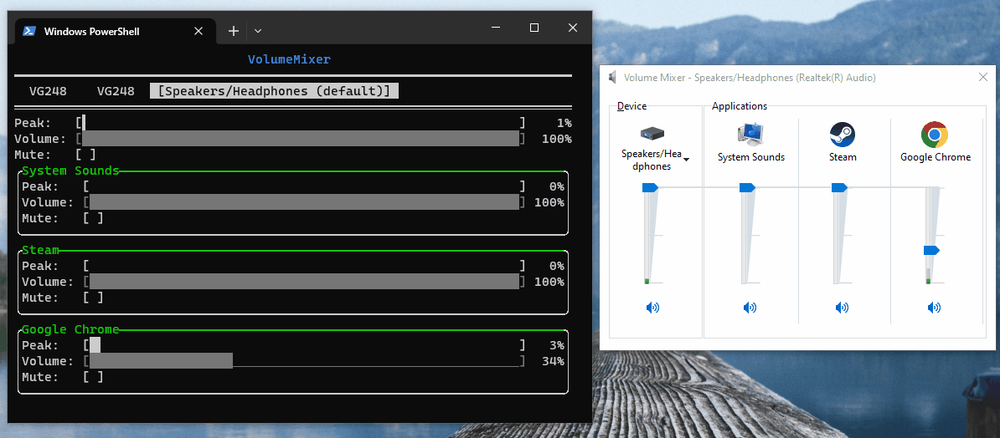

<p align="center">
  </img>
</p>

## vmx

<i>Volume Mixer</i>

C++ Volume Mixer Library for Big OSes.

## Features

## Documentation

## Operating systems
- Windows
- macOS (planned)

## How to use in your project

vmx works out of the box with CMake's FetchContent.
```cmake
include(FetchContent)

FetchContent_Declare(
  vmx
  GIT_REPOSITORY https://github.com/kyleoshaughnessy/vmx
  GIT_TAG        v0.0.2-alpha
)
FetchContent_MakeAvailable(vmx)
```

From here, you can simply link to vmx::core via `target_link_libraries`.

In the future, pre-built binaries may be added to tagged releases.
